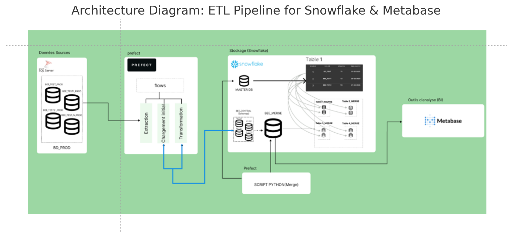

# ETL Pipeline for Snowflake Data Warehouse (BeeOne Project)

An end‑to‑end, production-grade ETL (Extract‑Transform‑Load) pipeline designed to streamline data integration from multiple SQL Server sources into a central Snowflake data warehouse. The processed data is then analyzed through the Metabase BI platform. This solution supports modular configuration per client, automated workflows, centralized dashboards, and secure tenant-level isolation.

---


---


## Table of Contents

1. [Features](#features)
2. [Architecture Overview](#architecture-overview)
3. [Detailed Component Roles](#detailed-component-roles)
4. [Technologies Used](#technologies-used)
5. [Installation](#installation)
6. [Configuration](#configuration)
7. [Usage Guide](#usage-guide)
8. [Project Structure](#project-structure)
9. [Troubleshooting](#troubleshooting)
10. [Contributing](#contributing)
11. [License](#license)

---

## Features

* **Client-Agnostic ETL** – Multi-client support using per-client YAML config files.
* **Modular ETL Workflow (Prefect)** – Isolated steps for extract, transform, load to improve maintainability.
* **Automated Table Creation** – Snowflake tables generated via SQL scripts with dynamic options.
* **Transformation & Cleansing** – Normalizes structure and removes errors for Snowflake compatibility.
* **Central Merge Layer** – Unified analytics across clients with client-specific tagging.
* **Embedded BI (Metabase)** – Personalized dashboards using JWT and Snowflake role-based access control.

---

## Architecture Overview

This architecture represents the core flow and responsibilities from raw data to BI visualization:

1. **SQL Server** – Raw client data (agriculture, production, finance, etc.)
2. **ETL Flow (Prefect)** – Extracts, transforms, and loads data to Snowflake
3. **Snowflake DW** – Client schemas and `BEE_MERGE` for central reporting
4. **Merge Script** – Consolidates client data into a global schema
5. **Metabase Embedded** – Displays client-specific dashboards securely

---

## Detailed Component Roles

### 1. SQL Server (Raw Data Layer)

* **Role:** Provides the original source data per client.
* **Tasks:** SQL queries defined in `queries.py` use ODBC connection settings from YAML config.

### 2. Prefect (Workflow Orchestrator)

* **Role:** Automates ETL with well-defined Python flows.
* **Tasks:**

  * `extract.py`: Pulls data into DataFrames
  * `transform.py`: Cleans and formats data
  * `load.py`: Loads into Snowflake via `write_pandas`

### 3. Snowflake (Data Warehouse)

* **Role:** Centralized cloud data store per tenant.
* **Tasks:**

  * Schemas per client
  * Supports fast analytic queries
  * Secure role-based access control

### 4. Python Merge Script

* **Role:** Combines all client schemas into one global schema.
* **Tasks:**

  * Reads from each client schema
  * Appends data to `BEE_MERGE.PUBLIC`
  * Adds `ID_CLIENT` tag for traceability

### 5. Metabase Embedded

* **Role:** Visual interface for analytics, embedded in SaaS app.
* **Tasks:**

  * Uses JWT with role + client\_id
  * Loads filtered dashboards
  * Provides isolated experience per tenant

---

## Technologies Used

| Component           | Resource                                                                                                                                        |
| ------------------- | ----------------------------------------------------------------------------------------------------------------------------------------------- |
| Python 3.9+         | [python.org](https://www.python.org) – Core programming language used throughout the project                                                    |
| Prefect 2.x         | [docs.prefect.io](https://docs.prefect.io) – Orchestration framework for defining and running workflows                                         |
| Snowflake Connector | [docs.snowflake.com](https://docs.snowflake.com) – Enables Python-to-Snowflake connectivity and data loading                                    |
| pandas, NumPy       | [pandas.pydata.org](https://pandas.pydata.org) – Data manipulation and transformation libraries                                                 |
| SQLAlchemy + PyODBC | [sqlalchemy.org](https://docs.sqlalchemy.org) / [pyodbc GitHub](https://github.com/mkleehammer/pyodbc) – ORM and driver for querying SQL Server |
| PyYAML              | [pyyaml.org](https://pyyaml.org) – YAML configuration file parsing for per-client settings                                                      |
| Questionary         | [github.com/tmbo/questionary](https://github.com/tmbo/questionary) – Interactive CLI prompts                                                    |
| Metabase BI         | [metabase.com/docs](https://www.metabase.com/docs/latest/) – Visualization platform embedded in SaaS app                                        |

---

## Installation

```bash
git clone https://github.com/Hamzabakh1/PRJ_ETL_METABASE_PFE1.git
cd PRJ_ETL_METABASE_PFE1
python -m venv venv
source venv/bin/activate  # or venv\Scripts\activate on Windows
pip install -r requirements.txt
pip install pyodbc         # (if not installed automatically)
```

Make sure to:

* Install ODBC driver for SQL Server (version 17+)
* Set up a Snowflake account with required roles and schema access

---

## Configuration

Each client has a YAML file located in `Clients/<ClientName>/config.yml`:

```yaml
client_id: client1
client_name: "Client One"
source_db:
  driver: "{ODBC Driver 17 for SQL Server}"
  server: YOUR_SERVER
  database: YOUR_DB
  trusted_connection: "yes"
snowflake:
  account: YOUR_ACCOUNT
  user: YOUR_USER
  password: YOUR_PASSWORD
  warehouse: YOUR_WH
  database: YOUR_DB
  schema: CLIENT1
  role: YOUR_ROLE
etl:
  create_or_replace: false
  date_format: "%Y-%m-%d"
  etl_flow: "Flows/ETL/flow_prefect.py"
```

Use environment variables for sensitive credentials (e.g., `SF_PASSWORD`).

---

## Usage Guide

### 1. Create Tables in Snowflake

```bash
python Flows/Creation/creation.py --client client1
```

Optional: `--replace`, `--dry-run`

### 2. Run ETL Flow

```bash
python Flows/ETL/flow_prefect.py
```

Interactive: choose a client or `all`

### 3. Merge All Clients (optional)

```bash
python Merge/Merge.py
```

Appends all data into `BEE_MERGE.PUBLIC.*` and tags rows with `ID_CLIENT`

---

## Project Structure

```
PRJ_ETL_METABASE_PFE1/
├── Clients/
│   └── client1/config.yml
├── Flows/
│   ├── Creation/creation.py
│   └── ETL/
│       ├── extract.py
│       ├── transform.py
│       ├── load.py
│       └── flow_prefect.py
├── Merge/
│   └── Merge.py
├── Tables/
│   ├── Queries/queries.py
│   └── Table/create_tables.sql
├── requirements.txt
└── README.md
```

---

## Troubleshooting

* **ODBC Errors:** Check SQL Server network settings, driver install, and config.
* **Snowflake Errors:** Ensure the user has schema & warehouse access.
* **No Data Loaded:** Validate queries and table structure.
* **Merge Errors:** Ensure `CLIENT_DATABASES` control table is populated.

---

## Contributing

1. Fork the repo
2. Create a feature branch: `git checkout -b feature/my-feature`
3. Commit changes: `git commit -m "Add new feature"`
4. Push and open a pull request

⚠️ **Important:** Do not hardcode credentials. Use environment variables or secrets management.

---

## License

© 2025 Hamza Bakh – All rights reserved.
No license granted for reuse or distribution. Contact the author for any usage beyond private experimentation.
